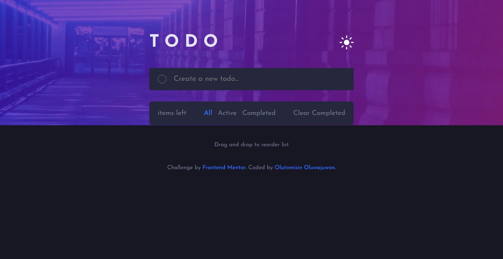

# Frontend Mentor - Todo app solution

This is a solution to the [Todo app challenge on Frontend Mentor](https://www.frontendmentor.io/challenges/todo-app-Su1_KokOW). Frontend Mentor challenges help you improve your coding skills by building realistic projects. 

## Table of contents

- [Overview](#overview)
  - [The challenge](#the-challenge)
  - [Screenshot](#screenshot)
  - [Links](#links)
  - [Built with](#built-with)
  - [What I learned](#what-i-learned)
- [Author](#author)

## Overview
This is a project i love  very much because it is the first project i worked on as my main javascript project. It took me a while, but i'm really happy i went through each stage whilst using all i've learnt about javascript. It took me about 2 weeks to complete this project.

### The challenge

Users should be able to:

- View the optimal layout for the app depending on their device's screen size
- See hover states for all interactive elements on the page
- Add new todos to the list
- Mark todos as complete
- Delete todos from the list
- Filter by all/active/complete todos
- Clear all completed todos
- Toggle light and dark mode
- **Bonus**: Drag and drop to reorder items on the list

### Screenshot

### Links

- Solution URL: [Solution URL on frontendmentor](https://www.frontendmentor.io/solutions/todo-app-using-html-css-javascript-and-sortablejs-for-drag-and-drop-HySct0KHq)
- Live Site URL: [Live Site](https://oluwajuwonomoyele-todo-app.netlify.app/)

### Built with

- Semantic HTML5 markup
- CSS custom properties
- Flexbox
- Mobile-first workflow
- Vanilla Javascript

### What I learned

I learnt basically how to use more effectively, Javascript. Also i learnt about event delegation and event bubbling and the various types of drag events

## Author

- Frontend Mentor - [@Oluwajuwonomoyele](https://www.frontendmentor.io/profile/Oluwajuwonomoyele)
- Twitter - [@OlutomisinJuwon](https://twitter.com/OlutomisinJuwon)

